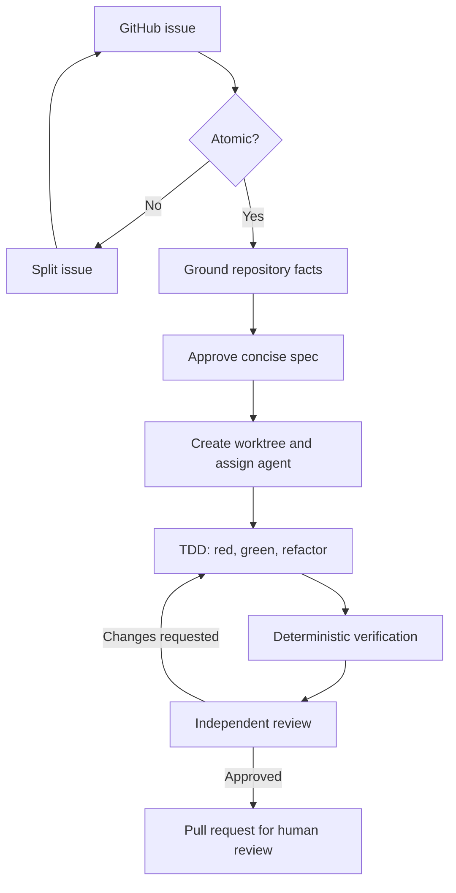

# Atomwright

**Local-first workflow that turns GitHub issues into atomic, grounded, tested, independently reviewed pull requests using coordinated coding agents.**

> **Status: pre-alpha / design phase.** Atomwright is being defined and its implementation has not started yet. The workflow below describes the intended product, not currently available functionality.

## Why Atomwright?

Agentic development can move quickly, but it often creates oversized specifications, duplicated context, unverifiable assumptions, tangled branches, and pull requests that are difficult to review.

Atomwright is designed around a smaller unit of delivery:

> **One issue → one atomic specification → one isolated worktree → one coding agent → TDD → deterministic verification → independent review → one pull request.**

An atomic change must be independently mergeable, revertible, testable, and useful. If an issue is too large, Atomwright splits it before implementation begins.

## Core principles

- **Atomic by default** — one independently valuable outcome per issue and pull request.
- **Short specifications** — enough context to remove ambiguity, without producing documents larger than the change.
- **Grounded execution** — repository evidence takes precedence over agent memory or assumptions.
- **SDD + TDD, always** — behavior is specified first and implemented through red, green, and refactor.
- **Isolated parallelism** — every programmer works in a dedicated Git worktree and branch.
- **Independent review** — the agent that writes the code cannot approve its own work.
- **Deterministic gates** — tests, linters, type checks, and repository rules decide whether work may advance.
- **Cost awareness** — retrieve only the context needed for the current decision and avoid repeating work across agents.
- **Human control** — humans approve implementation, review the final pull request, and decide when to merge.

## Planned workflow

The user interacts with one **Foreman** instead of manually managing multiple coding sessions. The Foreman plans and coordinates the work, while separate worker processes operate in isolated worktrees.

For example, asking Atomwright to use four programmers on four issues should create up to four independent lanes:

| Issue | Agent | Worktree | Branch | Result |
| --- | --- | --- | --- | --- |
| `#101` | Programmer 1 | Isolated | Dedicated | One PR |
| `#102` | Programmer 2 | Isolated | Dedicated | One PR |
| `#103` | Programmer 3 | Isolated | Dedicated | One PR |
| `#104` | Programmer 4 | Isolated | Dedicated | One PR |

No two agents share a working directory. A worktree is removed only after its pull request is merged or closed and Atomwright verifies that no uncommitted or unpushed work would be lost.

## The atomic change package

Each issue produces a compact set of artifacts:

| Artifact | Purpose |
| --- | --- |
| `spec.md` | Defines one outcome, acceptance scenarios, invariants, and explicit non-goals. |
| `grounding.md` | Records repository-backed facts and labels uncertain claims as verified, inferred, or unknown. |
| `design.md` | Captures architectural decisions only when APIs, security, concurrency, data, or migrations are affected. |
| `tasks.md` | Breaks implementation into a small sequence of steps linked to the specification. |
| `evidence.json` | Machine-generated proof: tests, TDD evidence, checks, commit, pull request, and review result. |

Specifications should remain short. Tasks are implementation steps, not separate outcomes. Architecture is documented only when the change actually requires an architectural decision.

## Grounding instead of guesswork

Atomwright cannot guarantee that a model never hallucinates. It can, however, prevent unsupported claims from silently becoming implementation decisions.

The planned Grounding Gate follows three rules:

1. Every material technical claim must point to current repository evidence: source files, Git history, code intelligence, tests, or project documentation.
2. Memory is a discovery aid, never proof. Stored decisions must be revalidated against the current base commit.
3. Contradictions, stale indexes, and material unknowns block implementation until they are resolved.

In short: **no source, no fact; no test, no behavior; no green gate, not done.**

## SDD and TDD

Atomwright treats specification-driven development and test-driven development as one continuous loop:

- The specification defines observable behavior with concise scenarios.
- Tests translate those scenarios into executable checks.
- The programmer demonstrates a meaningful failing test before implementation.
- The smallest change makes the test pass.
- Refactoring is allowed only while the complete verification suite remains green.
- Evidence connects every accepted scenario to its test and result.

## Planned architecture

Atomwright is intended to be an independent, heavily simplified derivative of [Gentle AI](https://github.com/Gentleman-Programming/gentle-ai). It will retain the useful installer and orchestration foundations while replacing the broad workflow with a focused atomic-delivery pipeline.

| Component | Responsibility |
| --- | --- |
| Foreman | Single user-facing coordinator and policy owner. |
| OpenSpec | Compact atomic SDD schema and change lifecycle. |
| Claude Code | Initial coding-agent runtime. |
| CCCC | Persistent coordination between agent processes. |
| Git worktrees | Filesystem and branch isolation for parallel programmers. |
| Engram | Durable decisions and project memory. |
| CodeGraph | Repository structure and dependency intelligence. |
| Shipwright | Deterministic verification gates. |
| GitHub | Issues, branches, pull requests, and human review. |

The initial release will deliberately use one agent runtime. Model routing and role-specific models may be added later, after the workflow is reliable and measurable.

## Cost is a design constraint

Atomwright aims to reduce token consumption without weakening verification:

- retrieve relevant code instead of loading the whole repository;
- reuse grounded artifacts across planning, implementation, and review;
- keep specifications bounded and omit unnecessary design documents;
- send each programmer only its issue, approved change package, and relevant code context;
- run deterministic tools before asking a reviewer model to reason about failures;
- limit repair cycles and escalate unresolved work to a human;
- measure token use per issue and pull request.

The goal is not the cheapest possible answer. It is the lowest-cost path to a trustworthy, reviewable change.

## Roadmap

- [ ] Fork and prune the Gentle AI core
- [ ] Define the atomic OpenSpec schema
- [ ] Implement grounding and atomicity gates
- [ ] Add worktree lifecycle management
- [ ] Connect CCCC worker coordination
- [ ] Integrate Engram and CodeGraph
- [ ] Enforce TDD and Shipwright verification
- [ ] Generate machine-readable evidence
- [ ] Add independent review and bounded repair loops
- [ ] Create draft pull requests and safe cleanup
- [ ] Measure cost, latency, and success per change

## Non-goals for the first release

- A general-purpose multi-agent chat platform
- Unlimited autonomous execution
- Supporting every coding agent and model provider
- Large planning documents for their own sake
- Automatic merging without human approval
- Learning from past runs before the base workflow is dependable

## Project origin

Atomwright is planned as an independent project derived from the open-source Gentle AI codebase. It is not affiliated with or endorsed by Gentle AI, Anthropic, OpenAI, or the maintainers of the listed integrations.

## License

The project license will be finalized before the first public release. Any derived source will retain all notices and obligations required by its upstream licenses.
