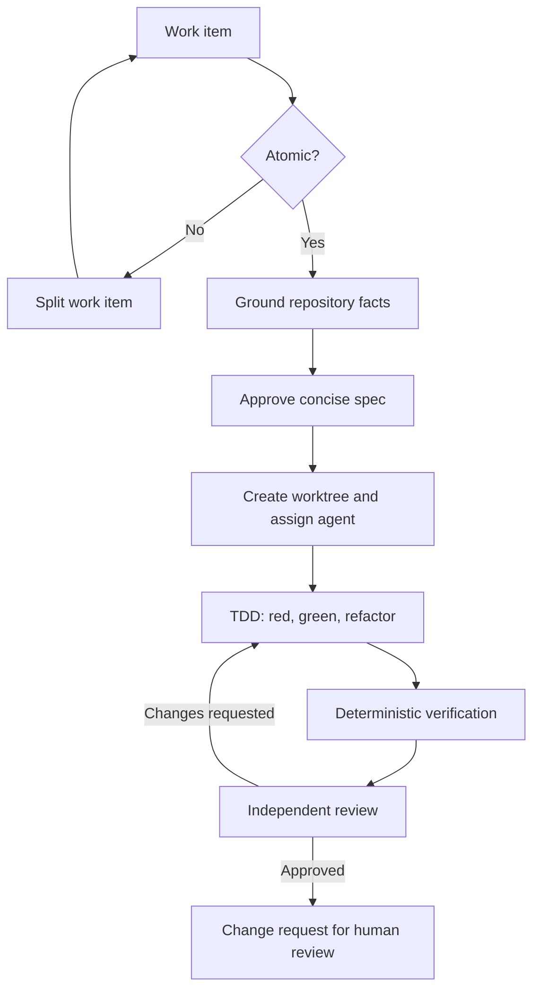

# Atomwright

**Local-first workflow that turns work items into atomic, grounded, tested, independently reviewed changes using coordinated coding agents.**

> **Status: pre-alpha.** Atomwright has been forked from [Gentle AI](https://github.com/Gentleman-Programming/gentle-ai)
> at the upstream baseline recorded in [`docs/atomwright/upstream-baseline.md`](docs/atomwright/upstream-baseline.md).
> The atomic-delivery workflow described below is the intended product and is **not** implemented yet.
> The CLI shipped in this repository is still the inherited Gentle AI runtime. It is invoked as
> `atomwright`, stores its state in `~/.atomwright/`, and reads `ATOMWRIGHT_*` environment
> variables. No `gentle-ai` executable is shipped; the only compatibility provided is that legacy
> configuration in `~/.gentle-ai/` is migrated on startup and `GENTLE_AI_*` variables are still read
> as deprecated aliases. Install with the curl script or `go install` — see
> [`docs/quickstart.md`](docs/quickstart.md#install).

## Why Atomwright?

Agentic development can move quickly, but it often creates oversized specifications, duplicated context, unverifiable assumptions, tangled branches, and changes that are difficult to review.

Atomwright is designed around a smaller unit of delivery:

> **One work item → one atomic specification → one isolated worktree → one coding agent → TDD → deterministic verification → independent review → one change request.**

An atomic change must be independently mergeable, revertible, testable, and useful. If a work item is too large, Atomwright splits it before implementation begins.

## Core principles

- **Atomic by default** — one independently valuable outcome per work item and change request.
- **Short specifications** — enough context to remove ambiguity, without producing documents larger than the change.
- **Grounded execution** — repository evidence takes precedence over agent memory or assumptions.
- **SDD + TDD, always** — behavior is specified first and implemented through red, green, and refactor.
- **Isolated parallelism** — every programmer works in a dedicated Git worktree and branch.
- **Independent review** — the agent that writes the code cannot approve its own work.
- **Deterministic gates** — tests, linters, type checks, and repository rules decide whether work may advance.
- **Cost awareness** — retrieve only the context needed for the current decision and avoid repeating work across agents.
- **Human control** — humans approve implementation, review the final change request, and decide when to merge.
- **Platform-neutral core** — GitHub is the first integration, while issue tracking and code hosting remain replaceable adapters.
- **Execution-neutral gates** — Shipwright is the first verification engine, while CI/CD execution remains replaceable.

## Planned workflow

The user interacts with one **Foreman** instead of manually managing multiple coding sessions. The Foreman plans and coordinates the work, while separate worker processes operate in isolated worktrees.

For example, asking Atomwright to use four programmers on four work items should create up to four independent lanes:

| Work item | Agent | Worktree | Branch | Result |
| --- | --- | --- | --- | --- |
| `#101` | Programmer 1 | Isolated | Dedicated | One change request |
| `#102` | Programmer 2 | Isolated | Dedicated | One change request |
| `#103` | Programmer 3 | Isolated | Dedicated | One change request |
| `#104` | Programmer 4 | Isolated | Dedicated | One change request |

No two agents share a working directory. A worktree is removed only after its change request is merged or closed and Atomwright verifies that no uncommitted or unpushed work would be lost.

## Platform integrations

Atomwright separates orchestration from external platforms. Its core works with normalized concepts such as **work item**, **repository**, **branch**, **change request**, **review**, and **status**, rather than embedding GitHub-specific behavior in the workflow.

The first release will target GitHub end to end. Later adapters may connect the same workflow to:

- Jira, Linear, ClickUp, or another system for work-item intake and status;
- GitLab, Bitbucket, Azure DevOps, or another code host for repositories and change requests;
- mixed setups, such as a Jira issue producing a GitHub pull request.

Adapters translate provider-specific identifiers and capabilities at the boundary. The atomicity, grounding, TDD, verification, evidence, and review rules remain provider-independent. Supporting a new platform should require an adapter, not a fork of the workflow engine.

## Verification and CI integrations

Atomwright defines verification as a provider-neutral contract: a set of named gates, their inputs, results, evidence, and blocking policy. The workflow engine does not need to know whether those gates run locally or inside a particular CI/CD product.

**Shipwright will be the first and default verification backend.** Later execution adapters may run the same logical gates through:

- native GitHub Actions workflows;
- Bitbucket Pipelines;
- GitLab CI/CD;
- Azure Pipelines;
- another local or hosted execution engine.

A project can therefore use GitHub for source hosting without being forced to use GitHub Actions, or use Bitbucket for both source hosting and pipelines. Backend-specific features remain inside adapters; Atomwright consumes a normalized gate result and records it in the evidence package.

## The atomic change package

Each work item produces a compact set of artifacts:

| Artifact | Purpose |
| --- | --- |
| `spec.md` | Defines one outcome, acceptance scenarios, invariants, and explicit non-goals. |
| `grounding.md` | Records repository-backed facts and labels uncertain claims as verified, inferred, or unknown. |
| `design.md` | Captures architectural decisions only when APIs, security, concurrency, data, or migrations are affected. |
| `tasks.md` | Breaks implementation into a small sequence of steps linked to the specification. |
| `evidence.json` | Machine-generated proof: tests, TDD evidence, checks, commit, change request, and review result. |

Specifications should remain short. Tasks are implementation steps, not separate outcomes. Architecture is documented only when the change actually requires an architectural decision.

## Grounding instead of guesswork

Atomwright cannot guarantee that a model never hallucinates. It can, however, prevent unsupported claims from silently becoming implementation decisions.

The planned Grounding Gate follows three rules:

1. Every material technical claim must point to current repository evidence: source files, Git history, code intelligence, tests, or project documentation.
2. Memory is a discovery aid, never proof. Stored decisions must be revalidated against the current base commit.
3. Contradictions, stale indexes, and material unknowns block implementation until they are resolved.

In short: **no source, no fact; no test, no behavior; no green gate, not done.**

## SDD and TDD

Atomwright treats specification-driven development and test-driven development as one continuous loop:

- The specification defines observable behavior with concise scenarios.
- Tests translate those scenarios into executable checks.
- The programmer demonstrates a meaningful failing test before implementation.
- The smallest change makes the test pass.
- Refactoring is allowed only while the complete verification suite remains green.
- Evidence connects every accepted scenario to its test and result.

## Planned architecture

Atomwright is intended to be an independent, heavily simplified derivative of [Gentle AI](https://github.com/Gentleman-Programming/gentle-ai). It will retain the useful installer and orchestration foundations while replacing the broad workflow with a focused atomic-delivery pipeline.

| Component | Responsibility |
| --- | --- |
| Foreman | Single user-facing coordinator and policy owner. |
| OpenSpec | Compact atomic SDD schema and change lifecycle. |
| Claude Code | Initial coding-agent runtime. |
| CCCC | Persistent coordination between agent processes. |
| Git worktrees | Filesystem and branch isolation for parallel programmers. |
| Engram | Durable decisions and project memory. |
| CodeGraph | Repository structure and dependency intelligence. |
| Verification adapters | Execute normalized gates and return evidence. Shipwright ships first and is the default. |
| Platform adapters | Work items, repositories, change requests, reviews, and status synchronization. GitHub ships first. |

The initial release will deliberately use one agent runtime. Model routing and role-specific models may be added later, after the workflow is reliable and measurable.

## Cost is a design constraint

Atomwright aims to reduce token consumption without weakening verification:

- retrieve relevant code instead of loading the whole repository;
- reuse grounded artifacts across planning, implementation, and review;
- keep specifications bounded and omit unnecessary design documents;
- send each programmer only its work item, approved change package, and relevant code context;
- run deterministic tools before asking a reviewer model to reason about failures;
- limit repair cycles and escalate unresolved work to a human;
- measure token use per work item and change request.

The goal is not the cheapest possible answer. It is the lowest-cost path to a trustworthy, reviewable change.

## Roadmap

- [x] Fork the Gentle AI core at a verified upstream baseline
- [ ] Prune the inherited Gentle AI core
- [ ] Define the atomic OpenSpec schema
- [ ] Implement grounding and atomicity gates
- [ ] Add worktree lifecycle management
- [ ] Connect CCCC worker coordination
- [ ] Integrate Engram and CodeGraph
- [ ] Enforce TDD through provider-neutral verification gates
- [ ] Ship the first verification adapter: Shipwright
- [ ] Define adapters for native GitHub Actions, Bitbucket Pipelines, and other CI/CD backends
- [ ] Generate machine-readable evidence
- [ ] Add independent review and bounded repair loops
- [ ] Ship the first platform adapter: GitHub issues and pull requests
- [ ] Define the adapter contract for Jira, GitLab, ClickUp, and other platforms
- [ ] Create draft change requests and safe cleanup
- [ ] Measure cost, latency, and success per change

## Non-goals for the first release

- A general-purpose multi-agent chat platform
- Unlimited autonomous execution
- Supporting every coding agent and model provider
- Supporting every CI/CD backend in the first release
- Large planning documents for their own sake
- Automatic merging without human approval
- Learning from past runs before the base workflow is dependable

## Project origin

Atomwright is an independent fork of the open-source
[Gentle AI](https://github.com/Gentleman-Programming/gentle-ai) project by Gentleman Programming.

It is **not** official, sponsored, endorsed, certified, partnered with, or affiliated with Gentle
AI, Gentleman Programming, Anthropic, OpenAI, or the maintainers of any listed integration. The full
fork statement is in [`NOTICE.md`](NOTICE.md).

The upstream trademark policy is reproduced unchanged in [`TRADEMARKS.md`](TRADEMARKS.md) and governs
the marks it describes.

The public CLI identifiers have been renamed: the command is `atomwright`, state lives in
`~/.atomwright/`, and environment variables use the `ATOMWRIGHT_` prefix (with `GENTLE_AI_*` kept
as a deprecated, still-read alias).

Other technical identifiers inherited from Gentle AI remain unchanged on purpose, because renaming
each is a migration rather than a rename: the Go module path
`github.com/gentleman-programming/gentle-ai/v2`, the `gentle-ai.<name>/vN` protocol identifiers, the
`<!-- gentle-ai:... -->` markers injected into agent configuration files, the `GENTLE_AI_REVIEW_*`
reviewer prompt markers, the `GENTLE_AI_TELEMETRY` value pinned in the published telemetry contract,
the `<git-common-dir>/gentle-ai/` review authority store path, the `gentle-ai-*` skill IDs, the
agent-side installed filenames, the embedded assets and golden files, the telemetry endpoint and
schema ids, and the `gentle-telemetry` collector binary. See [`NOTICE.md`](NOTICE.md) and
[`docs/atomwright/upstream-baseline.md`](docs/atomwright/upstream-baseline.md) for the full
register and the reason each one is deferred.

## License

Atomwright is distributed under the [MIT License](LICENSE), inherited from Gentle AI.

The upstream copyright notice is retained in full, as the license requires, alongside the
Atomwright copyright for subsequent modifications. Trademark and brand usage is governed separately
by the unchanged upstream [`TRADEMARKS.md`](TRADEMARKS.md); the MIT license grants copyright
permissions only, and does not grant permission to use upstream project names or logos.
