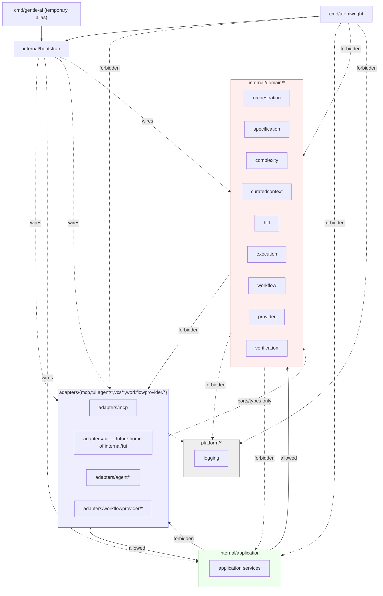
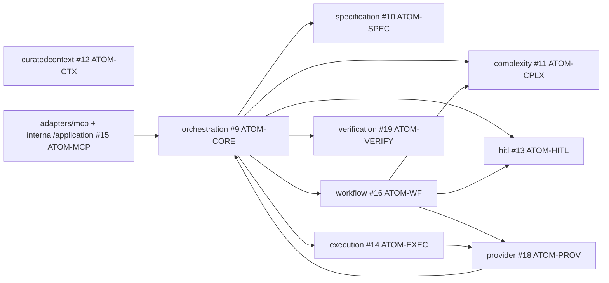

# ADR-0001: Modular-Monolith Skeleton for Atomwright

## Status

Accepted

## Date

2026-09-14

## Deciders

Atomwright maintainers, via #60 ATOM-BOOT / #61 ATOM-BOOT-001.

## Context

Atomwright's code today lives almost entirely under a flat `internal/*` (around forty packages — `agents`, `pipeline`, `planner`, `storage`, `tui`, `verify`, `catalog`, `providercontractbundle`, and more) plus a single CLI entrypoint, `cmd/gentle-ai`. There is no enforced boundary between domain logic, orchestration/CLI/TUI glue, and infrastructure — packages import each other as convenient, because nothing prevents it.

Ten functional epics (#9 ATOM-CORE, #10 ATOM-SPEC, #11 ATOM-CPLX, #12 ATOM-CTX, #13 ATOM-HITL, #14 ATOM-EXEC, #15 ATOM-MCP, #16 ATOM-WF, #18 ATOM-PROV, #19 ATOM-VERIFY) each describe a distinct bounded context — orchestration/control plane, atomic specs, complexity budgets, curated context, HITL gates, execution, MCP-facing application services, workflows, providers, verification. Building all ten directly on top of today's undifferentiated `internal/*` would let each epic improvise its own boundaries, and nothing would stop the accumulated result from becoming a ball of mud once several people or agents work on it in parallel.

`getsyntegrity/verimand-platform` is used here **purely as a structural and tooling reference** — its composition-root pattern, its layered boundaries, and its `go list`-based architecture tests are worth adapting. Its domain, its module names, and its business logic are not: nothing from Verimand is imported, copied, or renamed into Atomwright.

Two hard constraints, set before this ADR was written, bound the decision space:

1. No microservices. No HashiCorp `go-plugin`. No internal gRPC. No separate processes for providers in V1 — providers are in-process Go interfaces wired by an explicit registry.
2. Domain code must never import UI/MCP/TUI, concrete providers (Claude Code, OpenCode, OpenSpec, GitHub), or infrastructure (SQLite, Git, observability) — the classic hexagonal dependency direction.

Two additional facts surfaced while preparing this ADR, both from inspecting the real state of `main` and the repo's history, and both are addressed under **Related work** below rather than treated as blockers:

- The Go module path is `github.com/gentleman-programming/gentle-ai/v2` today. This ADR does not rename it — see **Non-goals**.
- A prior, unmerged PR (#5, closed) already attempted a CLI/brand rename from `gentle-ai` to `atomwright` as a single large change, explicitly keeping the module path unchanged. This ADR does not adopt that single-shot approach for the composition root — see **Decision** and **Rejected / deferred alternatives**.

## Decision

Atomwright stays a **single-process, single-module, modular monolith** for V1. The package layout is:

- **`internal/domain/{orchestration,specification,complexity,curatedcontext,hitl,execution,workflow,provider,verification}`** — one package per bounded context, mapping 1:1 to epics #9, #10, #11, #12, #13, #14, #16, #18, #19. Pure domain logic only: types, invariants, domain errors. No import outside the Go standard library and other `internal/domain/*` packages when a concept is genuinely shared across contexts.
- **`internal/application`** — application services that orchestrate one or more domain packages on behalf of adapters. This is grounded directly in #15 ATOM-MCP's own stated language: "MCP tools map to application services rather than bypassing the domain." Adapters call into `internal/application`, never into domain internals directly.
- **`internal/bootstrap`** — the composition-wiring package. It constructs concrete adapters, platform services, and domain/application instances, and wires them together with explicit constructors — no reflection-based DI container. **It is the only package in the entire codebase allowed to import concrete implementations from every layer at once.** The object graph exists in exactly one place.
- **`cmd/atomwright`** — the single composition-root binary. `main.go` handles arguments and process/signal concerns and calls straight into `internal/bootstrap`. `cmd/atomwright` does **not** import adapters, application, domain, or platform packages directly — its only in-repo dependency is `internal/bootstrap`; everything else it touches is the Go standard library and process-level concerns (flags, signals, exit codes). This decision is closed, not open: CORE, MCP, and TUI entry points converge here. `cmd/gentle-ai` keeps existing as a temporary legacy/migration surface under the same restriction — not a second composition root, but a thin, deprecated alias that also imports only `internal/bootstrap` — until the functional epics have migrated their entry points and it can be retired.
- **`platform/*`** — cross-cutting infrastructure, starting with `platform/logging`. Never imports `internal/domain`.
- **`adapters/*`** — outward-facing implementations: `adapters/mcp` (#15), `adapters/agent/{claudecode,opencode}` and `adapters/vcs/gitworktree` (#14), `adapters/workflowprovider/{direct,openspec}` (#16). Adapters implement ports (interfaces) declared by `internal/domain` or application services declared by `internal/application`. Implementing a domain-declared port requires importing `internal/domain` — that import is allowed, but **scoped strictly to port interfaces and their contractual types** (the shapes a port's methods take as arguments or return), never to reach into domain internals or call domain logic directly from an adapter. Ports themselves stay declared in `internal/domain`, next to the domain concept they belong to — they are not relocated into `internal/application` merely to keep adapters' import graph one-directional; `internal/application` is an orchestrator of domain behavior, not an artificial owner of every contract the domain exposes. Domain and application are never imported back *by* adapters for anything beyond that port/type surface, and adapters are never imported by domain or application at all. Today's `internal/tui` is the conceptual predecessor of an eventual `adapters/tui` — whether and when to physically relocate it is deferred (see **Decision classification**).

### Dependency direction



Rule, stated as the canonical allowlist (this exact table is what #65 ATOM-BOOT-005 makes executable):

```
cmd/*             -> internal/bootstrap
internal/bootstrap -> internal/application, internal/domain/*, adapters/*, platform/*
adapters/*         -> internal/application
adapters/*         -> internal/domain/*      [ports and contractual types only]
internal/application -> internal/domain/*
platform/*         -> stdlib, platform/* internals
internal/domain/*  -> stdlib, other internal/domain/* packages (explicitly shared concepts only)

internal/domain/*    -X-> internal/application
internal/domain/*    -X-> adapters/*
internal/domain/*    -X-> platform/*
internal/application -X-> adapters/* (concrete)
cmd/*                -X-> adapters/* (concrete)
cmd/*                -X-> internal/application, internal/domain/*, platform/* (directly)
```

`cmd/atomwright` and `cmd/gentle-ai` see only `internal/bootstrap` plus the Go standard library — never a concrete adapter, application service, domain package, or platform package directly. `internal/bootstrap` is the single package allowed to see concrete implementations from every layer at once. `adapters/*` importing `internal/domain/*` is allowed **only** to implement a port interface or use a type that port's contract requires — never to call domain logic or reach into domain internals; ports stay declared in `internal/domain`, not relocated to `internal/application`.

### Bounded-context map



This map only draws edges already implied by existing epic text (#20's `Blocks` list; #16's AC4 "a workflow provider cannot bypass HITL or complexity policies"; #18's `Depends on` #9; #15's "MCP tools map to application services"). It documents currently-known relationships — it is **not** a pre-approval of any cross-context import. Every edge still has to earn its way into the ATOM-BOOT-005 allowlist explicitly, on its own merits, when the story that needs it lands.

## Decision classification

### Accepted now

- Single-process, single-module modular monolith for V1.
- The five-layer package boundary (`internal/domain/*`, `internal/application`, `internal/bootstrap`, `platform/*`, `adapters/*`) and the hexagonal dependency direction between them.
- `cmd/atomwright` as the sole composition root, backed by `internal/bootstrap`; `cmd/gentle-ai` as a temporary, non-composition-root legacy alias.
- No per-bounded-context `go.mod` (see **Modules**, with the explicit criterion for revisiting it).
- No `go-plugin`/gRPC/out-of-process providers in V1 — providers are in-process interfaces wired by `internal/bootstrap`'s registry.
- `platform/logging` wraps Go's standard `log/slog`; no new third-party logging dependency.
- Health/readiness is a local self-check (extending `internal/doctor`, or an `atomwright mcp ping`-style command), not an HTTP endpoint.
- Dependency-direction enforcement will be **executable** (Go tests using `go list`/`go list -json`/`go list -m`), backed by a default-deny allowlist expressed as Go data, with mandatory negative `testdata/` fixtures per rule. The mechanism is decided here; the implementation is #65 ATOM-BOOT-005.

### Deferred

- Whether and when to physically relocate `internal/tui` under `adapters/tui`.
- Any rename of the Go module import path — an independent initiative, last touched by the closed, unmerged PR #5, which explicitly kept the module path unchanged. This ADR does not revisit that.
- The exact shape and timing of a future `ATOM-PLUG` epic for out-of-process providers, if that need is ever proven.
- Whether `platform/*` grows beyond `logging` (e.g. `platform/config`) before a concrete story needs it.
- `make check` and CI wiring specifics — that is #66 ATOM-BOOT-006.

### Open hypotheses

- That nine domain packages, one per current epic, are the right granularity. They may need to split or merge once #62 ATOM-BOOT-002 and the first real functional stories land.
- That `internal/bootstrap` stays a single, manageable package as wiring grows; if it doesn't, its internal structure (not the "only bootstrap sees everything" rule) is what would change.

## Consequences

**Benefits:** every functional epic gets a stable package to grow into instead of improvising one; the dependency direction is a mechanically checkable fact once #65 ATOM-BOOT-005 lands, not a convention that erodes under parallel work; there is exactly one place (`internal/bootstrap`) where concrete wiring decisions live, making the whole system's composition auditable in one package.

**Costs:** more packages and more indirection than today's flatter `internal/*` layout; any future cross-boundary import requires an explicit, reviewed allowlist change instead of "just importing it"; the codebase carries two CLI entrypoints (`cmd/atomwright`, `cmd/gentle-ai`) during the migration window, which is real, temporary complexity that must be tracked to actual retirement, not left indefinitely.

## Rejected / deferred alternatives

- **A `go.mod` per bounded context now** — rejected. Verimand splits modules because it ships two binaries consuming divergent module combinations; Atomwright ships one composition root needing every context together, so that reason doesn't apply. Deferred until a bounded context has a genuine, independent lifecycle/build/versioning/distribution need — not for aesthetic separation.
- **`fx` or another reflection-based DI container** — rejected in favor of explicit constructors in `internal/bootstrap`, for compile-time-checked, readable wiring.
- **`koanf` or another configuration library** — not decided here; deferred to whichever issue first needs structured configuration.
- **`kit-logger`** (Verimand's private logging dependency) — rejected; `log/slog` is sufficient and adds no dependency.
- **HashiCorp `go-plugin` / gRPC / out-of-process providers** — rejected for V1; deferred to a future `ATOM-PLUG` epic if an out-of-process need is ever proven.
- **HTTP-style health/readiness endpoints** — rejected; Atomwright is a CLI/MCP tool with no listening process to probe.
- **A single large "rename" PR for `cmd/gentle-ai` → `cmd/atomwright`**, as attempted in the closed, unmerged PR #5 — superseded by the incremental coexistence-then-retire approach in **Decision**.

## Related work

- `getsyntegrity/verimand-platform` — structural/tooling reference only (composition-root pattern, `go list`-based architecture tests, default-deny allowlist). No domain or module names reused.
- PR #5 (closed, unmerged), "refactor(cli)!: rename the public CLI to atomwright with a safe state migration" — prior exploration of the CLI/brand rename. It explicitly kept the Go module path (`github.com/gentleman-programming/gentle-ai/v2`) unchanged and renamed `cmd/gentle-ai` to `cmd/atomwright` as one large change. This ADR does not adopt that as the composition-root migration strategy.
- #60 ATOM-BOOT and its children #61–#66, and the functional epics #9, #10, #11, #12, #13, #14, #15, #16, #18, #19 — this ADR exists to unblock them without implementing any of their stories.
